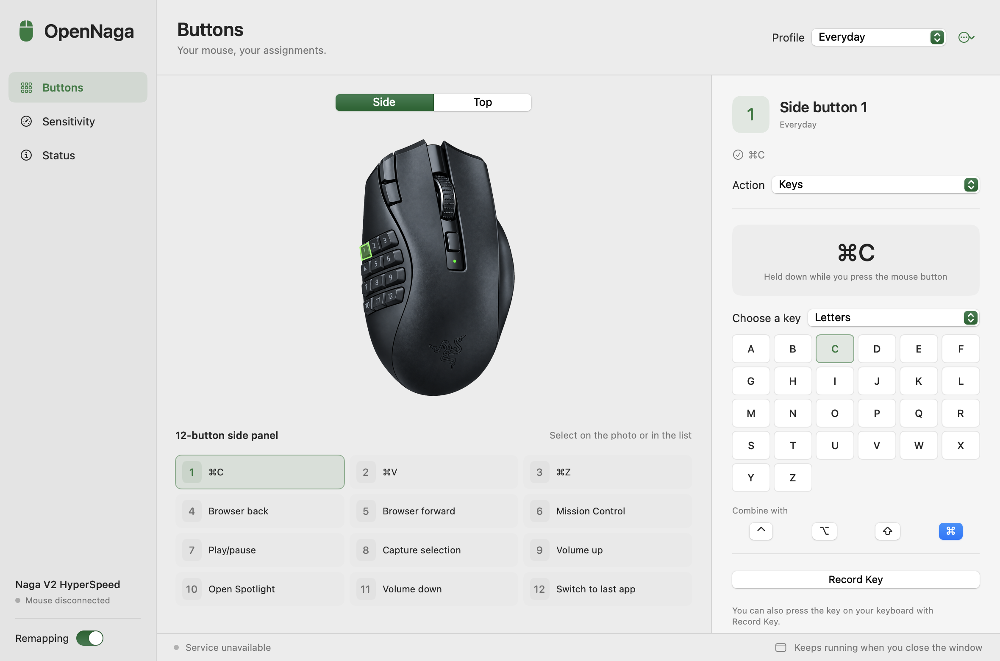

# OpenNaga

Free, open-source macOS app for the Razer Naga V2 HyperSpeed, a replacement for Razer Synapse, which does not support this mouse on the Mac. It remaps the 12 side buttons and the extra mouse controls, and reads or changes DPI and polling rate over the USB receiver.

OpenNaga is an independent project, not affiliated with or endorsed by Razer. It started from [DParent10/NagaController](https://github.com/DParent10/NagaController) and has since been rewritten with a new interface, hardware control and input engine.

<picture>
  <source media="(prefers-color-scheme: dark)" srcset="Documentation/screenshot-dark.png">
  
</picture>

## Features

- Adaptive macOS settings window with a restrained green accent and three sections: Buttons, Sensitivity, Status
- Interactive mouse photographs with side-button highlights, a top view and a matching assignment grid for all 19 logical controls
- Actions per button: keyboard keys selected by category or recorded, with optional modifiers, multi-step key sequence, mouse action (browser back/forward, real mouse buttons 4/5, middle/left/right click, scroll), launch application, shell command, macro, profile switch, disabled, or original passthrough
- System editor with 25 actions for audio, playback, brightness, screenshots, windows, spaces and macOS tools, with a preview button
- Existing text snippets remain saved and can be replaced through the Keys editor
- Profiles with auto-save, import/export as JSON, rename/duplicate/delete
- DPI (100 to 30000 per axis) and polling rate (125/500/1000 Hz) read and written through the Razer USB protocol, with read-back verification
- Optional "driver mode" for the top DPI buttons, with journaled restore of the original mode at quit
- Menu bar popover with profile selection and remapping toggle; closing the settings window keeps the service running
- Remapping activity prevents App Nap while allowing normal system sleep

## Requirements

- macOS 13.0 or later. The downloadable DMG contains an Apple Silicon build; Intel Macs must build from source.
- Razer Naga V2 HyperSpeed connected through its HyperSpeed USB receiver (`1532:00b4`) for DPI, polling rate and driver mode. The app also recognizes the Bluetooth identity `068e:00b5`, shown by macOS as "Naga V2 HS". Bluetooth detection is verified; physical button remapping still needs on-device verification.
- Xcode Command Line Tools with Swift 5.9+ to build from source

## Install and first run

1. Download `OpenNaga-v2.2.0.dmg` from the [latest release](https://github.com/Zer0codestuff/OpenNaga/releases/latest), or build the app bundle (see below).
2. Open the DMG and drag `OpenNaga.app` to Applications. Permissions are tied to the app location, so do not move it afterwards.
3. The release is not notarized. On first launch right-click the app and choose Open, or run `xattr -dr com.apple.quarantine /Applications/OpenNaga.app`.
4. Launch it. macOS prompts for two permissions; both are required:
   - Accessibility (System Settings > Privacy & Security > Accessibility)
   - Input Monitoring (System Settings > Privacy & Security > Input Monitoring)
5. Open the settings window from the menu bar icon, turn on "Remapping", and assign actions.

Upgrading from NagaController 2.x: quit it, delete `/Applications/NagaController.app`, then install OpenNaga. Your profiles are kept. macOS may ask for the two permissions again.

The Status section shows the current permission state, the detected device, and the last input seen. If a permission was granted after launch, macOS may require restarting the app.

Button assignments are saved on the Mac, not to the mouse's onboard memory. The same selected profile is used for USB receiver and Bluetooth connections. OpenNaga must keep running in the menu bar to apply it; closing the settings window is fine, quitting the app stops remapping.

## Assign system controls

Select a mouse button, choose **System** in the **Action** menu, then pick a category and function. The selection saves immediately. **Test** runs the selected function without pressing the mouse button.

| Category | Functions |
| --- | --- |
| Audio | Volume up, volume down, mute toggle |
| Playback | Play/pause, previous track, next track |
| Brightness | Display brightness up/down |
| Screenshots | Full screen or selection to a file or clipboard, screenshot and recording tools |
| Windows and Spaces | Mission Control, app windows, desktop, previous/next space, hide app, switch to the last app |
| Tools | Spotlight, Finder, System Settings, Notification Center, Do Not Disturb |

Each physical press runs the action once, with no hold repeat. Existing audio mappings appear under System without being rewritten. Shell commands remain a separate action type.

Screenshots, Mission Control and space navigation use the keyboard shortcuts configured in macOS. Disabled or unassigned shortcuts show setup instructions instead of sending a different key combination. Do Not Disturb requires an enabled shortcut in System Settings > Keyboard > Keyboard Shortcuts > Mission Control. OpenNaga does not change these preferences. Spotlight opens directly even when its keyboard shortcut is disabled.

Brightness uses the Mac's brightness keys, so an external monitor must support brightness control through macOS. Media controls target the active playback app. Focus settings may sync Do Not Disturb to other Apple devices.

## Build from source

```bash
bash Scripts/build_app.sh        # release bundle, signed with the dev identity if available
open OpenNaga.app
```

Without a signing identity the bundle is ad-hoc signed and macOS forgets its permissions on every rebuild. For development, create a local self-signed identity once:

```bash
bash Scripts/make_dev_certificate.sh   # creates "NagaController Dev" in the login keychain
```

`build_app.sh` picks it up automatically. Set `SIGNING_IDENTITY="Developer ID Application: ..."` to use a real identity instead. Builds are not notarized.

To produce the distributable disk image (ad-hoc signed, with an Applications shortcut):

```bash
bash Scripts/make_dmg.sh              # writes OpenNaga-v<version>.dmg
```

## Tests and diagnostics

```bash
bash Scripts/test.sh             # dependency-free checks, no XCTest needed
```

Read-only hardware diagnostics (requires Input Monitoring for the launching process):

```bash
open OpenNaga.app --args --diagnose-file /tmp/naga.json
cat /tmp/naga.json
```

Add `--verify-hardware` to also write back the current DPI and polling values and confirm the read-back. Values are not changed.

Capture the UI without starting the input or hardware services:

```bash
open -n OpenNaga.app --args --snapshot /tmp/ui.png --snapshot-appearance dark --snapshot-size 980x700 --snapshot-button 8
```

Appearance, size and selected button are optional snapshot controls. See [the verification record](Documentation/verification-2026-09-08.md) for tested flows and remaining device checks.

## How input handling works

- `HIDListener` observes vendor `1532` devices whose product ID is `00b4` or whose name contains "naga", plus the exact Bluetooth identity `068e:00b5`, on a background run loop. It does not enumerate other products under the Bluetooth vendor ID.
- Each physical press/release is recorded with its timestamp. `EventTapManager` consumes a matching system event only if it arrives within 25 ms of a recorded HID edge, so regular keyboards are never blocked.
- Synthetic events are tagged through `eventSourceUserData` and ignored by the tap.
- Held buttons are released on stop, disconnect, profile change, or when the tap is disabled by the system.
- Buttons 13 to 16 (DPI, wheel tilt) rely on documented driver-mode reports and are only reported when a matching report is observed.

## Project structure

The Swift package, target and source folder keep the internal name `NagaController`, as do the bundle identifier and the `~/Library/Application Support/NagaController` folder, so existing permissions and profiles carry over.

- `Sources/NagaController/ButtonMapping/` action model, event synthesis, layout-aware browser shortcuts
- `Sources/NagaController/EventTap/` CGEvent tap and correlation with HID input
- `Sources/NagaController/HID/` IOHID listener and pure report decoding
- `Sources/NagaController/Hardware/` Razer USB protocol codec, IOHID feature-report transport, device controller
- `Sources/NagaController/UI/` SwiftUI settings window and menu bar popover
- `Sources/NagaController/Utils/` profiles storage, permissions, battery monitor
- `Tests/` dependency-free test sources run by `Scripts/test.sh`
- `Resources/` Info.plist, bundled default profiles and transparent mouse images
- `Resources/Mouse/README.md` image sources, generation prompts and transparency verification

## Credits and license

OpenNaga started as a fork of [NagaController](https://github.com/DParent10/NagaController) by DParent10, also MIT licensed. Protocol facts come from the published OpenRazer sources and pull request 2850; no GPL code is included. Code is licensed under MIT, see [LICENSE](LICENSE). Mouse image provenance is documented in [Resources/Mouse/README.md](Resources/Mouse/README.md).
